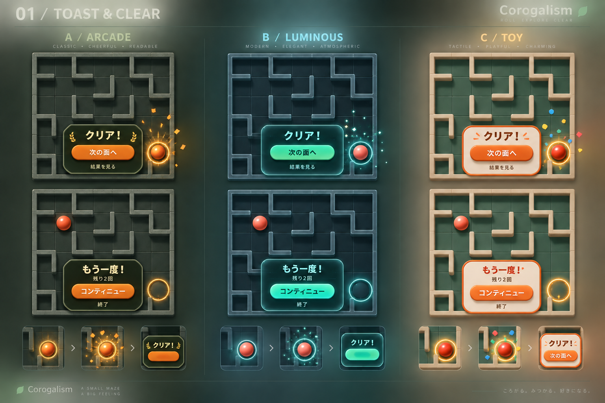
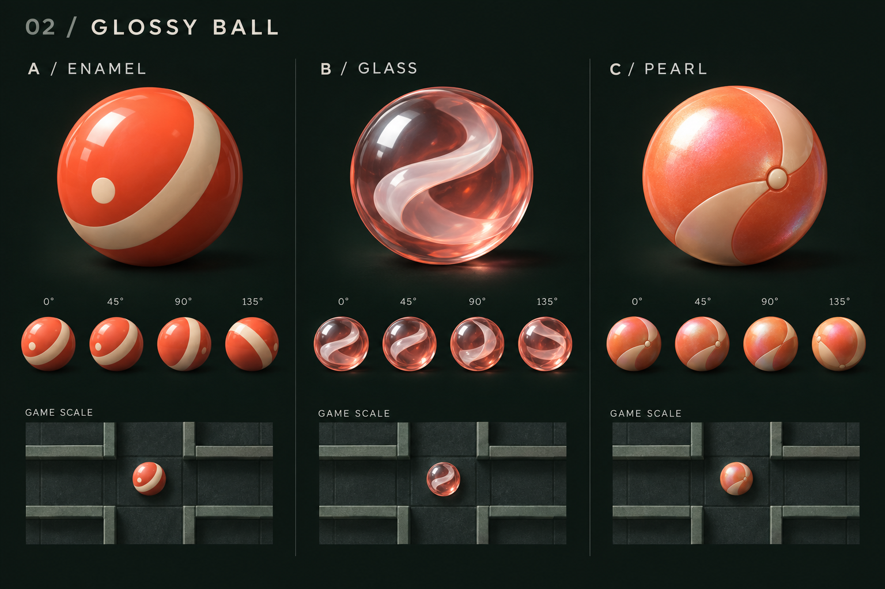
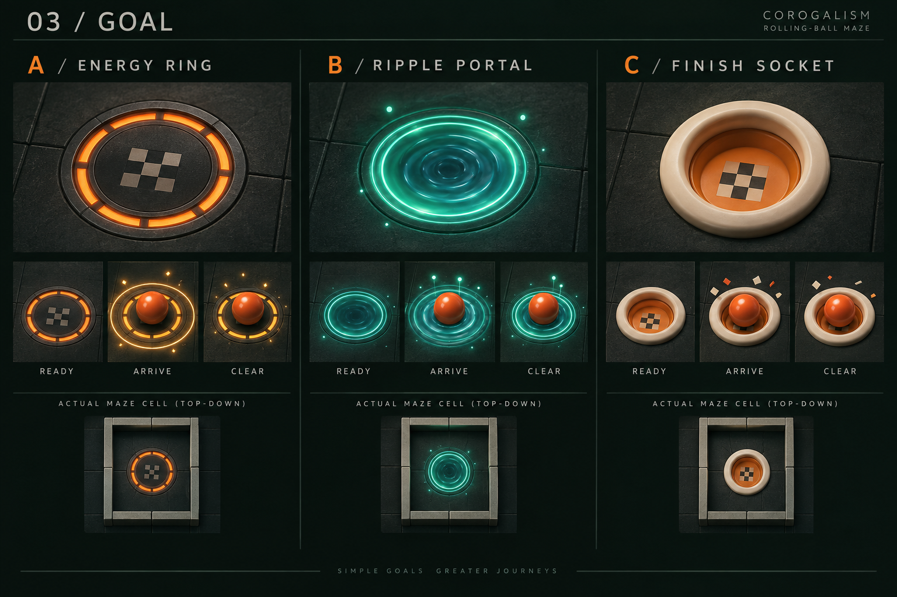
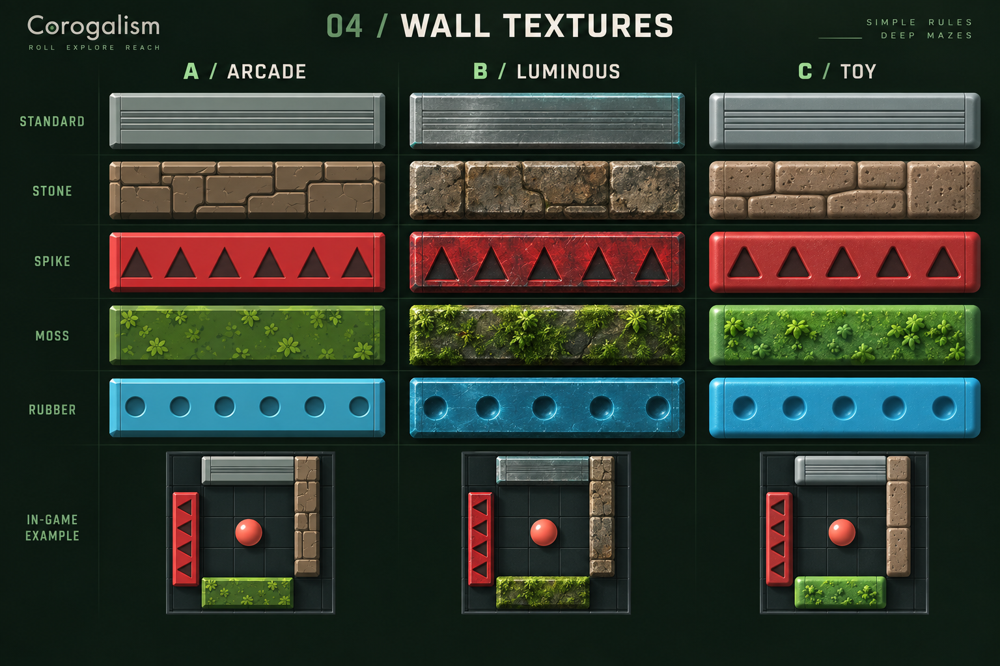

# Corogalism ビジュアル比較案（2026-09-12）

**採用決定:** 全項目C案。比較画像左下の葉マーク＋Corogalismロゴも採用。実装は `../../toy-visuals.md`。

画像で方向性を相談するためのコンセプト。各項目から個別に組み合わせて選択できる。ゲームへの実装・公開反映は次の作業で扱う。

## 今回のフィードバック

- 正式URLは https://corogalism.sikumilab.com/ 。2026-09-12にHTTPS GETで200とページタイトルを確認。
- v0.2.1で序盤はクリアできるようになったとのユーザー報告。
- クリア時に次面ボタンが現れ、下へスクロールする挙動を改善したい。
- クリア・コンティニューをゲームらしいトーストにし、クリア演出も追加したい。
- 光沢のある球体と転がる表現、ゴール、壁の質感を相談したい。
- ボール素材によるゲーム要素は今後改めて相談する。

## 3方向の比較

| 要素 | A | B | C |
|---|---|---|---|
| トースト・クリア演出 | アーケード調、金色の放射光と紙吹雪 | 透けるパネル、光の粒と波紋 | トイ調の立体ボタン、カラフルな紙吹雪 |
| ボール | 帯と点のある光沢エナメル調 | 内部の渦が見えるガラス玉 | 分割模様のあるパール調 |
| ゴール | 発光するフィニッシュリング | 波紋が広がるポータル | 球が収まるカップ |
| 壁 | 明快な色・模様と陰影 | 石や苔の細かな質感 | 丸い縁と成形玩具の質感 |

## トーストと演出の動作案

- 盤面の位置と大きさを維持し、その内側へ重ねて表示する。新しい要素で文書の高さを変えず、スクロール移動を起こさない。
- クリア時はゴール付近の短い演出から「クリア！／次の面へ」の操作付きトーストにつなぐ。
- コンティニューは失敗時の盤面を背景に「もう一度！／残り回数／コンティニュー／終了」を表示。
- 操作付きトーストは選択まで保持。祝福の粒子や光だけが短時間で収束する。
- 画面・盤面を揺らす演出は今回の提案に含めない。

## ボール・ゴール・壁の動作案

- ボールの表面模様は移動方向・距離に連動して回転させる。光源方向のハイライトと接地影で球体の立体感を保つ。
- 画像内の回転フレームは動きの方向性を示す絵コンテで、厳密な回転角の検証画像ではない。
- ゴールの吸い込み・沈み込みはクリア判定後の演出案。穴などの新しいゲームルールを示すものではない。
- 壁の拡大サンプルは質感の比較用。実装では既存の細い壁・通路幅・衝突境界に合わせて簡略化する。
- 標準・石・棘・苔・ゴムの色と模様を併用する。ゴムは現行で配置されない定義済み素材の描画参考。
- 球の見た目によって物理や難易度を変える提案ではない。

## 比較画像

### 01 トースト・クリア演出・コンティニュー

### 02 光沢球・転がり

### 03 ゴール

### 04 壁の素材感

小さな盤面での見分けやすさと現在の配色との連続性を優先する場合は、トーストA・ボールA・ゴールA・壁Aが推奨。素材感を強めるなら壁Bを組み合わせられる。
