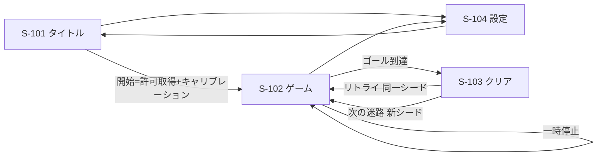

# 画面（フェーズ1）

画面の数・遷移・レイアウトは**目安**です。発案者の指示で自由に変更してよい範囲（`CLAUDE.md` §9）。

| ID | 画面 | 内容 |
|----|------|------|
| S-101 | タイトル | タイトル、「開発中の技術検証です」の注記、開始ボタン（**ここが iOS 許可取得のユーザー操作起点**）、設定への導線 |
| S-102 | ゲーム | 盤面（正方形）、タイム、壁ヒット数、一時停止、キャリブレーションのやり直し、操作モード表示 |
| S-103 | クリア | タイム、自己ベスト（更新時は明示）、使用シード、リトライ／次の迷路 |
| S-104 | 設定 | 操作モード切替、最大傾き角スライダー、キャリブレーション実行 |

## 注意

- **S-101 の開始ボタンは、iOS の `requestPermission()` を呼ぶユーザー操作起点を兼ねる。** ここを自動遷移にすると iOS で傾きが動かなくなる
- 許可が拒否された場合は擬似傾きモードで S-102 へ進む。**エラーで止めない**
- S-102 の盤面は正方形。画面が縦長・横長でも盤面自体は正方形を保つ（余白で調整）
- キャリブレーションはプレイ中（S-102）からも実行できること
