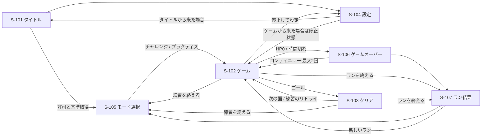

# 画面（フェーズ2 / v0.2.3）

v0.2.3ではタイトルとモード選択を統合して迷路を非表示にし、プラクティスを上に配置。開始／再開前に3カウントを表示する。S-103/S-106は非モーダルに変更し、背景の設定・終了も操作可能。ポーズは盤面上、再開は中央。最新仕様は `start-flow.md` を優先する。

v0.2.2ではS-103/S-106を盤面内のC案トーストに変更。HUDとS-102の配置を保持し、背景操作をinertにする。詳細は `toy-visuals.md`。
表示切替は `section.panel` と `section.game-toast` のhidden属性で管理する。以下の旧画面詳細より本注記を優先する。

画面の切り替えは `main.js` が `section.panel` の `hidden` で一元管理する。
`[hidden]{display:none!important}` を維持する。盤面は固定カメラの正方形。

| ID | 画面 | 内容 |
|---|---|---|
| S-101 | タイトル | 開発中の注記、開始、設定。開始クリックがiOSの許可取得と現在姿勢の基準取得の起点 |
| S-102 | ゲーム | チャレンジは盤面上に面数・残り時間・HP、盤面下にタイム・壁ヒット・操作・停止・再調整・設定・終了。練習はHP・制限時間なし |
| S-103 | クリア | 練習はタイム・自己ベスト・シードとリトライ／次の迷路。チャレンジは残HP・ノーダメージ表示と次の面／ラン終了 |
| S-104 | 設定 | 操作モード、最大傾き角、キャリブレーション。ゲームから開くと一時停止。閉じても手動再開 |
| S-105 | モード選択 | チャレンジ／プラクティス、ノーコン・コンティニュー使用の自己ベスト、操作のフォールバック案内 |
| S-106 | ゲームオーバー | HP0／時間切れの理由、失敗面、クリア面数、合計クリアタイム。残り回数内でコンティニュー／結果へ |
| S-107 | ラン結果 | クリア面数、合計クリアタイム、ノーミス面数、記録枠と更新結果、保存失敗時の案内。新しいラン／モード選択 |

## 表示と停止

- 残り時間は数字＋バー。残り25%以下で警告色。HP35%以下も警告色。
- ダメージは背景色と減少値を450ms表示。連続点滅はしない。
- 素材は色＋模様。凡例には現在の面に登場する素材だけを示し、開くとゲームを停止する。
- 一時停止、設定、タブ非表示で時間と物理が止まる。復帰は「再開」ボタン。
- 許可拒否・非搭載・値が届かない場合はタッチ／クリック操作へ切り替える。
- 横向きの傾き操作では縦向きへの警告。盤面は常に1画面内の正方形。
- `noindex` と開発中表示を維持する。これらを外す判断はフェーズ3。
