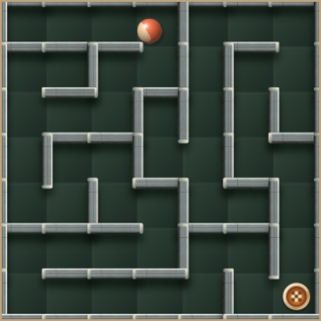
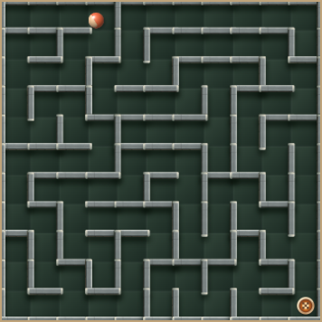

# 迷路の大きさ・形・反発遊びのバリエーション

2026-10-06 / T-278 / 検討案。ゲームへの実装・公開は未実施。

## 仕組みと今回の変更方針

同じ7×7でも、ゴールまでの道の長さ、曲がり角、脇道の形で体験は変わる。ただし現行本編は7×7固定で、基本面などでは複数の生成候補から短い経路を選んでいる。素材が変わっても、盤面の見渡し方や進み方が似る一因になり得る。単調さの原因と断定したものではない。

大きな迷路は「道を読む」遊びを増やし、壁の少ない面は「勢いと傾きを操る」遊びを増やす。どちらも同じ難易度の上げ方ではない。やさしいモードでも両方を混ぜ、時間やげんきの余裕と、迷路・操縦の面白さを別々に調整する案を推奨する。

以前の床追加設計にあった「7×7を維持」「短い経路を優先」を、本案ではすべての面に共通する前提から外す。現行のゲームはまだ変更していない。

会話で確認した方針:

- やさしいモードにも入り組んだ7×7と、8×8・9×9・11×11などを途中で織り交ぜる。
- 内壁が少なく、ゴムの反発と氷・重力・反重力を使って、苦労しながらゴールする面も候補にする。偶然のゴールも楽しさに含める。
- ボールが小さく、見づらい大盤面も試す。老眼への配慮を理由に11×11以上を候補から外さない。
- 面の壁配置は自動生成を維持する。素材・組み合わせ・サイズの採用上限は検証前に決めつけない。
- 素材を体験する前に難しさや飽きで離脱しないよう、早い段階から変化を見せる。

以下の面の配分、登場時期、生成方法は提案であり、採用済みの仕様ではない。

## 推奨する三つの面

| 種類 | 面の案 | 主な楽しさ | 難易度調整で見ること |
|---|---|---|---|
| 入り組んだ迷路 | 7×7でも長い迂回、連続する曲がり角、脇道、複数の進み方を作る | 道を読み、小回りで進む | 道を考える時間、壁への接触、行き止まりの負担 |
| 小さな大迷路 | 8×8・9×9・10×10・11×11などを混ぜる。13×13以上も比較する | 盤面を見渡す感覚と、細かく操る感覚の変化 | ボールの追いやすさ、移動距離、判断回数、端末負荷 |
| 反発を操る面 | 内壁を減らす、なくす、広場と迷路をつなぐ。ゴム壁、氷、引力・斥力を組み合わせる | 壁や力に乗る、軌道を修正する、偶然入る | 実際に操縦できるか、ゴールまでの時間、反発先のダメージ |

### 入り組んだ7×7

現行の基本生成では、サイズが同じなら壁の総数はほぼ同じでも、ゴールまでの経路は変わる。まずは「最短候補を常に選ぶ」選び方を面の目的に応じて変える。最長の道を毎回選ぶ方針にも置き換えない。

比較する案は、長い迂回がある一本道と、一部の壁を開けて複数の道を選べる迷路。後者は近道も生まれるため、開けた後に道の長さと曲がり角を計算し直す。行き止まりの量や、中央を横切る道なども生成条件として変える。固定の壁配置を使い回す方式にはしない。

### 大きさの変化

7→8→9→11と増やすだけでなく、大きな迷路の次に小さな反発面を出すなど、見た目と操作感の差を作る。8や10のような偶数サイズも既存の生成処理で扱える。

現在の速度と力の届く範囲は「1マス」を基準にしている。マス数が増えると、同じ速度でも画面上の移動は小さくなり、同じ範囲の重力床も盤面全体に対して小さく見える。サイズを変えるだけで、遊びの時間や力場の印象も変わる。

最初は現在の物理値のまま比較し、必要なら速度・範囲を変えた比較条件を明示する。サイズ変更と同時に、気づかれないよう加速や力を補正しない。

### 反発を操る面

まず比較したいのは、次の三案。壁や力の配置位置は面ごとに生成する。

1. 全面氷＋ゴム壁。内壁なしの広場から、壁が数本残る広場まで、反発と傾きだけで狙う。
2. 氷＋ゴム＋重力・反重力。重力の周りを回る軌道、進みたい方向と逆に引く配置、ゴール付近から押し返す配置なども試す。
3. 広場と迷路区画の混合。広場で付いた勢いを砂で受け止めて次の区画へ入る、ゴムで反射して通路へ入る、といった緩急を作る。

砂を必ずブレーキ用に限定することや、力場を補助方向だけに限定することはしない。全面砂、強い力場、石・トゲなどを含む組み合わせも検証に残し、正式なやさしいモードへの配分は結果から決める。

本編のゴム壁は既にダメージがない。反発先の標準壁・石などではげんきを失う。壁の性質を保ったまま、ゴム・コルク・こけなどの組み合わせと面の構成で調整する。一律のダメージ免除を追加する前提にはしない。

本編のボールは現在ビー玉のみ。スーパーボール＋ゴムは検証に残すが、以前の相談に従い今回の本編追加に自動的には含めない。綿の吸収壁・スライド壁・回復壁も将来の比較候補で、既存素材と混同しない。

## やさしいモードへの混ぜ方

新しい体験を20面以降だけに置くと、以前の到達範囲である12〜16面までに出会えない可能性がある。最初の数面から大きさか形を変え、11×11も早めに試せる配分を推奨する。

試遊で比較する初期案:

- 最初の6面程度に、8×8か9×9と、内壁の少ない反発面を混ぜる。
- 11×11は8〜12面程度で一度体験する並びを試す。より早い登場や、より大きな盤面も比較対象に残す。
- 大迷路の次に7×7の広場や休憩要素がある面を置き、細かい操縦が続く疲れと、同じ見た目の連続を確認する。

これは解禁条件や出現上限ではない。登場頻度と順番は未確定。公開試遊では各案へ直接移動できるようにし、そこまで進めない人も比較できる形を推奨する。

既存の床の紹介順と、面の大きさ・形の選択は分ける。初めての床と細かい大迷路を同時に出す案も残しつつ、それぞれ単独で体験した場合と比較する。通常限定「光の滑走路」と、その控えめな紹介は既存の役割を保つ。新しい迷路の変化はやさしいでも体験できる。

## 時間・げんき・ゴール判定

道が長い迷路では、今の経路長と曲がり角による加算が出発点になる。ただし道を探す時間、逆方向へ戻る時間も、人間の操作で確認する必要がある。

壁の少ない反発面では、最短経路は短くても実際の軌道は長くなる。現行の時間計算だけでは、操縦に必要な時間を短く見積もる可能性がある。げんきも現在は主に曲がり角から初期値を決めるため、開放的な面の負担を十分に表さない。

本編へ採用する際は、面の種類に応じた時間の余裕とげんきを、試遊の所要時間・接触・再挑戦から調整する。秒数はまだ決めない。検証では、時間・げんきを付けない比較と、本編相当の条件での比較を両方残す。移動の制限を後付けして面を成立させる方法を先に選ばない。

現在は、1回の更新が終わった時のボール中心がゴールの近くにあればクリアであり、止まる必要はない。偶然のゴールは既に可能。一方、高速で通過すると更新の間にゴールを横切り、判定から漏れる可能性がある。今回の試遊で見つかった不具合ではなく、反発面を作る時の確認事項。

必要なら、既存の移動区間通知 `onTravel` を使い「移動中にゴール範囲を通過したか」を判定する案を比較する。ボールを遅くする対策に決めつけない。死亡・時間切れとゴールが同じ更新で起きる場合の優先順位も、現行動作との違いを明示して確認する。

## 見せ方・演出

盤面は引き続き縦向きの1画面内に収める。11×11でボールを小さくする案をそのまま試し、見づらさが面白さになるか、追えなくなるかを別々に評価する。

比較候補は、既存の絵のまま、ボールの縁を少し強調、ゴールの目印を見つけやすくする、の三つ。物理的なボールの大きさや通路幅は、見せ方の変更だけで勝手に変えない。重力・反重力の外周境界線は、以前の依頼どおり復活させない。

面開始の見せ方は、既存の短い面名とREADYを使う案を推奨する。例えば「小さな大迷路」「反発の広場」のように遊びの違いを伝える。新しい説明画面や毎面の追加待機を必須にせず、既存のジングルとゲームの流れとの相性を試す。細かい設定値は通常プレイの案内には載せず、検証画面と共有データに持たせる。

## 既存処理で確認した結果

詳細な条件・生データは[計測記録](../../verification/maze-variation/README.md)。これは新しい面の完成検証ではない。

### 大きさと道の長さ

各サイズ200シード、既存の基本生成を使用。経路は最短ルートの通過マス数。ボール径は盤面幅294〜356 CSS px、現在の直径0.55マスから換算した表示上の値。

| サイズ | 経路の中央値 | 曲がり角の中央値 | ボールの表示径 |
|---|---:|---:|---:|
| 7×7 | 25 | 14 | 23.1〜28.0 px |
| 8×8 | 31 | 18 | 20.2〜24.5 px |
| 9×9 | 37 | 22 | 18.0〜21.8 px |
| 11×11 | 51 | 31 | 14.7〜17.8 px |
| 13×13 | 73 | 45 | 12.4〜15.1 px |

10・15・17・21も含め、計1,800標本の生成は完了。21×21はボール径7.7〜9.3pxになる。ここに載せたサイズは測定標本で、採用上限ではない。

現在のやさしい2面は同じ200入力シードで経路中央値17、曲がり角9。短い候補を選ばない12面は25と14だった。短い候補を選ぶ処理が経路を縮めていることは確認済み。ユーザーの体感の原因をこれだけで決めない。

### 描画と動作

Chromeで7〜21の9サイズ、通常床と現行の氷＋力場、画面密度1倍・3倍の36構成を確認。各構成でボールを動かし、80回の更新中、最後の60回の物理と描画の処理時間を測定した。PCのCPU処理を6倍遅くした条件であり、実端末や完全なゲーム画面の速さを表すものではない。

画面密度3倍での代表値（物理＋描画、中央値 / 遅い側5%の境界）:

| サイズ | 通常床 | 現行の氷＋力場 |
|---|---:|---:|
| 7×7 | 13.8 / 23.8 ms | 20.6 / 32.7 ms |
| 9×9 | 10.8 / 17.7 ms | 15.8 / 25.5 ms |
| 11×11 | 8.4 / 13.5 ms | 12.7 / 21.3 ms |
| 13×13 | 5.7 / 9.4 ms | 12.3 / 17.4 ms |

全36構成で座標・速度は有限値、ブラウザの実行エラーは0件。物理の中央値はおおむね0.2〜0.4msで、この条件では描画の方が大きかった。1秒に60回表示する場合の間隔16.7msを超える例があり、重い演出の改善余地は残る。実際の表示間隔、画面への合成、センサー、音、長時間動作を含む計測ではないため、60fps保証には使えない。

静止床と壁を画像として再利用するため、マス数が増えるほど毎回の描画が必ず重くなるわけではない。小さいボールの絵を描く負荷も変わる。生成そのものより、動くボールと力場の描画を優先して調べる根拠になる。

初回描画は、この条件で約51〜751msかかった。面開始前の既存READY中に描画用の画像を準備する案を検討し、時計が動き始めてから大きな初回処理を行わない。描画領域が復元された時の再作成も含めて確認する。

既存描画での大きさの参考。新しい生成方式や本編の完成画面ではない:

| 7×7 | 11×11 |
|---|---|
|  |  |

## 実装で扱う箇所

実装に進む時は、次の分け方を推奨する。新しい設計案であり、ファイル追加などは未着手。

1. 面の大きさと形を選ぶ情報を、既存の床・壁テーマと分ける。サイズ、経路の特徴、内壁の開け方を入力にして自動生成する。通常の迷路生成はゲーム固有の素材から独立させたままにする。
2. 壁を開けた後に、すべてのマスがつながりゴールへ行けるかを再確認する。最短経路と曲がり角を計算し直し、ボールが通れる幅と実際の操縦も確認する。
3. 床配置のために迷路候補を作り直す時にも、選んだ形の条件を引き継ぐ。複雑な面や広場が、現行の「短い基本迷路」への作り直しで失われないようにする。
4. 最終的な面の形に合わせて床・力場・アイテムを配置する。特殊床・ひとやすみ・とりもちは脇道にも置く。取得物はゴールへのルート上へ。複数経路がある時は、そのうち一つの基準ルートに置き、全ルートで必ず取れるという意味にはしない。
5. 面の種類に合わせた時間・げんきを計算する。乱数の種、サイズ、形の指定、生成方式の版を残し、同じ条件を再現できるようにする。本編へ採用して記録の条件が変わる時は、旧記録を消さずに分ける。

確認済みの修正対象:

- [stagePlay.js](../../../src/game/stagePlay.js): 本編生成が `BASE.mazeSize` 固定。面ごとのサイズを渡す箇所。
- [floorThemes.js](../../../src/world/floorThemes.js): ゴール周囲の除外が座標6固定。曲がり角の走査件数にも49固定がある。候補の選び方と再生成も対象。
- [generator.js](../../../src/maze/generator.js): 既にサイズを受け取れる。形を加工する処理と、最終的な到達性確認の接続を検討。
- [stage.js](../../../src/world/stage.js)、[themes.js](../../../src/world/themes.js): 面の形を床テーマ処理が上書きしない接続と、素材の配置。
- [progression.js](../../../src/game/progression.js): 経路と床の負担による現行時間計算。開放面の負担も扱う。
- 既存の床・ボール試遊は7×7固定の配置を持つ。新しいサイズを比べる際は、数字だけ差し替えず、配置と共有条件も対応する。

## 検証と採用を決める順序

推奨は、本編へ一括で混ぜる前に、公開の試遊で大きさ・形・組み合わせを直接比較すること。既存の「床の練習」はそのまま保ち、比較用の導線を分ける案とする。試遊には表示バージョン、設定と乱数の種の共有、実際の物理条件を付ける。既存の検証設定と本編相当の設定を混同しない。

確認項目:

- 複数の乱数の種で到達性、床・壁の位置、ボールが通れる幅、同条件での再現を確認する。生成できない条件も原因と設定を残す。
- ブラウザで傾き相当の入力を使い、ゴールへ実際に進む。自動的に解く操作モデルの成績だけで、人間にも易しいと判断しない。
- 本編相当の時間・げんきと、制限を付けない条件の両方で、ゴールの通過、連続反発、ブレーキ、再挑戦を試す。
- 実端末で小さい球を追えるか、狙って曲がれるか、飽きにくいか、難しさが楽しいかを確かめる。ゴールに苦労すること自体を不採用の理由にしない。
- 画面密度、寸法変更、長時間動作、描画復元、音とセンサーの同時動作を測る。重い条件を候補から外す前に、描画などの改善を検討する。
- 採用する配分を決めたら、最初の12〜16面の流れとして再確認する。新しい面だけでなく、難易度の山と休む間を調整する。

まだ決めていないのは、サイズと形の出現割合、入り組んだ7×7の選び方、反発面の内壁量と力場配置、面種別の時間・げんき。今回の計測ではこれらの面白さや適切な数値は確定していない。

正式採用・公開時に、ゲームのバージョン、キャッシュバスター、公開確認、ガイドと現行仕様をまとめて更新する。本資料の追加だけではゲームの表示バージョンを進めない。
